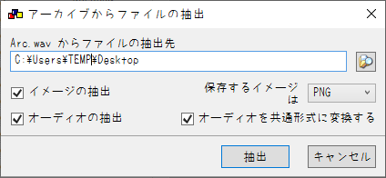
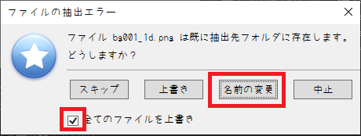
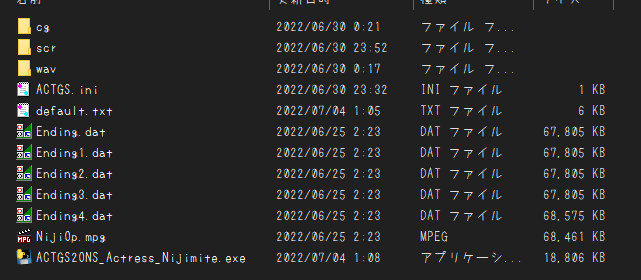

# ACTGS2ONS_Actress-Nijimite
## なにこれ
  2004年にACTRESS様から発売された、18禁PC向けノベルゲーム'[虹を見つけたら教えて。](https://www.actress.ne.jp/products/nijimite/index.html)'を 
  ONScripter形式へ変換するためのコンバータです 

## 再現度
原作との違いは主に以下
 - 画面特殊効果なし(*雨降りません*)
 - セーブ/ロード画面は超簡略化
 - CG/回想モードは未実装

## 使い方
 1. 適当な作業フォルダを作成
 2. [GARBro](https://drive.google.com/file/d/1gH9nNRxaz8GexN0B1hWyUc3o692bkWXX/view)で以下のアーカイブを作業フォルダへ展開 
    
     - Arc.wav → wav
     - Arc.scr → scr
     - Arc.cg → cg

     設定は以下の通り↓ 
      
      
 3. ゲーム側の設定用の.iniファイル、及び動画(.mpgとセーブ以外の.dat全て)を作業フォルダへコピー
 4. 展開先のディレクトリで[このコンバータ](https://github.com/Prince-of-sea/ACTGS2ONS_Actress_Nijimite/releases/latest)をDL/起動させ変換(最低でも数分程度はかかります) 
    変換前の時点で以下のような構成になっていればOKです↓ 
     
    ※変換中にいくつかエラーが出ますが無視して構いません 
 5. ウィンドウが消え、0.txtができれば完成 
    変換済みファイルと共に利用ハードへ転送

## 注意事項
 - 当然ですが公式ツールではありません
 - __FANZA DL版で動作確認しています__ パッケージ版の動作は未確認
 - 本ツールの使用において生じた問題や不利益などについて、作者は一切の責任を負いません

## その他
 - 本作の変換を追加でサポートする[PSP向け自動変換ツール作ってます](https://github.com/Prince-of-sea/ONScripter_Multi_Converter) 
    もしPSPで遊ぶ場合はぜひご利用ください(v1.2.9以上推奨)
 - ~~一応、他のACTGS作品にも流用できるように制作しています(800x600限定)~~ 
    ~~動作の安定性は全く保証できませんが、試してみてもいいかも...?~~ 
    思ったより汎用性がなくてうまく行ってません...